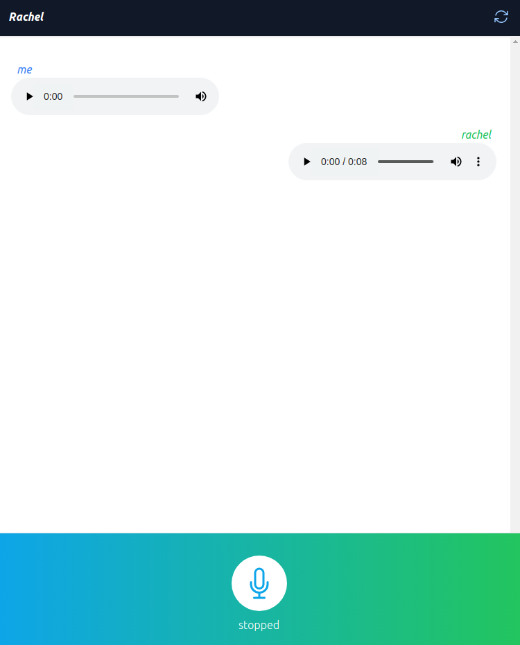

# RachelChat
A chatbot webapp built using ChatGPT, Vite/React, and TailwindCSS

Built during the following Udemy course: https://www.udemy.com/course/chatgpt-ai-voice-chatbot-build-with-react-and-fast-api-combo/?kw=chatgpt+react&src=sac

## Running
In one terminal, go to the backend folder and run `uvicorn main:app --reload`

In another terminal, go to the frontend folder and run `yarn dev`

### Note on API Keys
This project uses APIs from OpenAI and ElevenLabs. Get API keys from them and place in `RachelChat/backend/.envTODO_FILLIN` and rename that file to `.env`
